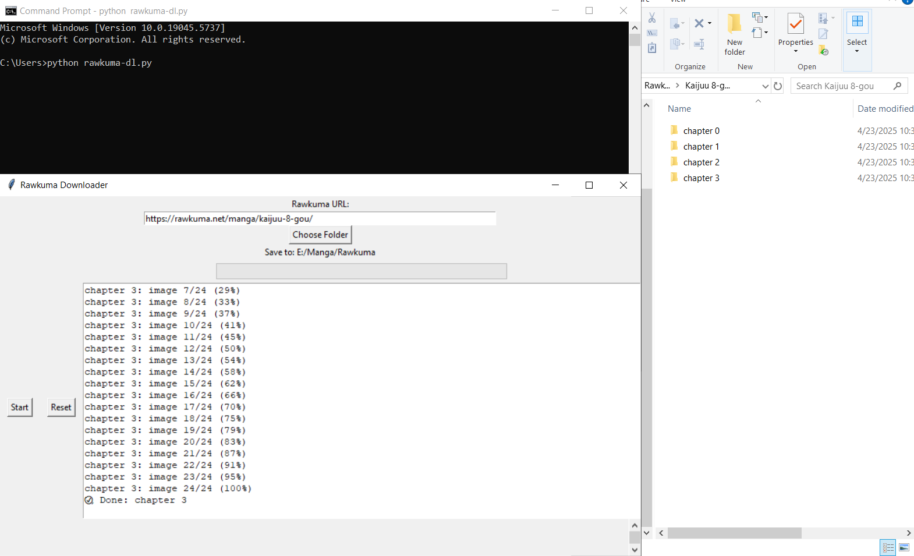

# Rawkuma Downloader

A simple tool to download manga chapters from [Rawkuma](https://rawkuma.net) - paste the URL, select a folder, and press Start!

## 🔧 Features
- Batch download chapters (even 100+)
- Smart folder detection (skip downloaded chapters)
- Auto-scroll and image fetching
- Progress bar & chapter logs
- Lightweight Tkinter GUI

## 🚀 How to use
1. Download the `.exe` file from `dist/`
2. Run it (no install needed)
3. Paste the manga URL from Rawkuma
4. Choose where to save
5. Click **Start** and enjoy offline reading!

## 🖼 GUI Preview

---

## 🚀 How to Use

1. **Download `rawkuma-dl.exe`** from [dist/](dist/)
2. Run it on Windows (double click)
3. Paste any Rawkuma manga URL (e.g., https://rawkuma.net/manga/kaijuu-8-gou/)
4. Choose folder to save chapters
5. Click `Start` – and it will do the rest!
