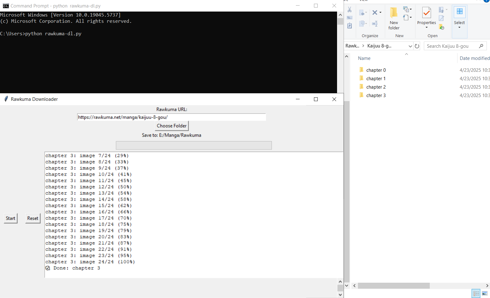

# Rawkuma Downloader

A lightweight desktop app to **download manga chapters** from [Rawkuma.net](https://rawkuma.net).

---

# Features

-  Simple GUI — no coding required
-  Choose any manga from `rawkuma.net`
-  Auto-detect and download all chapters (including `1.1`, `2.5`, etc.)
-  Smart skip if chapter already exists
-  Download multiple chapters in parallel (fast!)
-  Custom folder selection

---

# GUI Preview

---

# How to Use

1. **Extract** the downloaded `.zip`
2. **Double-click** `rawkuma-dl.exe` (in `dist` folder)
3. Paste any manga URL from `https://rawkuma.net/manga/...`
4. Click **Choose Folder** to set where downloads will be saved
5. Click **Start**
6. Wait and enjoy!

# Example Rawkuma URLs

Paste any **manga page URL**, like:

- `https://rawkuma.net/manga/kaijuu-8-gou/`
- `https://rawkuma.net/manga/one-piece/`

# Folder Structure (After Download)

Kaijuu 8-gou/chapter 0/0.jpg

# Notes

-  Compatible with Windows 10/11
-  Currently Windows-only (.exe build)
-  No browser required — everything is automatic
